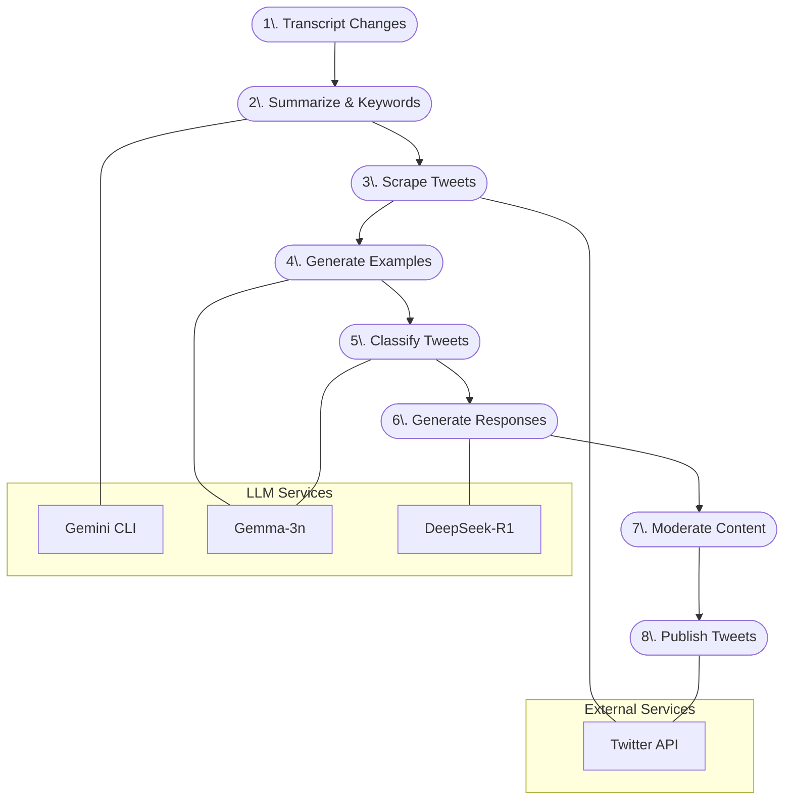

# WDF Podcast Social-Engagement Pipeline

A comprehensive pipeline for automating social media engagement for the "War, Divorce, or Federalism" podcast.

## Overview

This pipeline automates the following workflow:

1. **Transcript Monitoring**: Detects new or updated transcripts.
2. **Transcript Analysis**: Summarizes transcripts and extracts keywords using Gemini CLI.
3. **Tweet Scraping**: Finds relevant tweets based on extracted keywords.
4. **Few-Shot Example Generation**: Creates examples for the Gemma-3n classifier.
5. **Tweet Classification**: Classifies tweets as relevant or not using Gemma-3n.
6. **Response Generation**: Generates engaging responses to relevant tweets using DeepSeek-R1.
7. **Moderation**: Provides a TUI for moderating and approving responses before publishing.
8. **Publishing**: Posts approved responses to Twitter.

## Architecture



## Getting Started

### Prerequisites

- Python 3.10+
- Node.js and npm
- Poetry
- Ollama (for local LLM inference)
- Redis (for rate limiting)

### Installation

1. Clone the repository:

```bash
git clone https://github.com/wyatt727/WDF-Bot.git
cd WDF-Bot
```

2. Set up the environment:

```bash
make bootstrap
```

This will install all dependencies, including:
- Poetry and Python packages
- gemini-cli for Node.js
- Create necessary directories

### Running the Pipeline

#### Development Mode

```bash
make dev-run
```

#### Debug Mode (verbose logging)

```bash
make debug
```

#### Docker Mode

```bash
make docker-build
make docker-run
```

## Configuration

Configuration is managed through environment variables or a `.env` file:

### Core Settings

| Variable | Description | Default |
|----------|-------------|---------|
| `WDF_MOCK_MODE` | Use mock Twitter API | `true` |
| `WDF_OLLAMA_HOST` | Ollama API host | `http://localhost:11434` |
| `WDF_REDIS_URL` | Redis URL | `redis://localhost:6379/0` |
| `WDF_TRANSCRIPT_DIR` | Directory for transcripts | `transcripts` |
| `WDF_ARTEFACTS_DIR` | Directory for artefacts | `artefacts` |
| `WDF_DEBUG` | Enable debug mode | `false` |
| `WDF_RANDOM_SEED` | Random seed for deterministic mocks | `42` |

### LLM Models

| Variable | Description | Default |
|----------|-------------|---------|
| `WDF_LLM_MODELS__GEMINI` | Gemini model name | `gemini-2.5-pro` |
| `WDF_LLM_MODELS__GEMMA` | Gemma model name | `gemma-3n` |
| `WDF_LLM_MODELS__DEEPSEEK` | DeepSeek model name | `deepseek-r1` |

### Twitter API (Required for Production)

| Variable | Description |
|----------|-------------|
| `TWITTER_API_KEY` | Twitter API key |
| `TWITTER_API_SECRET` | Twitter API secret |
| `TWITTER_TOKEN` | Twitter access token |
| `TWITTER_TOKEN_SECRET` | Twitter access token secret |
| `WDF_TWITTER_RATE_LIMIT_BUDGET` | API calls per 15-minute window | `300` |

## Monitoring & Metrics

The pipeline exposes Prometheus metrics on port 8000 by default. You can access them at:

```
http://localhost:8000/metrics
```

### Available Metrics

| Metric | Type | Description |
|--------|------|-------------|
| `processing_latency_seconds` | Histogram | End-to-end processing latency for pipeline stages |
| `summary_latency_seconds` | Histogram | Time taken to generate summary |
| `fewshot_latency_seconds` | Histogram | Time taken to generate few-shot examples |
| `classify_latency_seconds` | Histogram | Time taken to classify tweets |
| `deepseek_latency_seconds` | Histogram | Time taken to generate tweet responses |
| `tweets_classified_total` | Counter | Number of tweets classified |
| `tweets_relevant_total` | Counter | Number of tweets classified as RELEVANT |
| `tweets_skipped_total` | Counter | Number of tweets classified as SKIP |
| `responses_generated_total` | Counter | Number of tweet responses generated |
| `tweets_approved_total` | Counter | Number of tweet responses approved |
| `tweets_edited_total` | Counter | Number of tweet responses edited |
| `tweets_rejected_total` | Counter | Number of tweet responses rejected |
| `tweets_published_total` | Counter | Number of tweets published |
| `redis_queue_length` | Gauge | Number of items in Redis queue |
| `pipeline_success_total` | Counter | Number of successful pipeline runs |
| `pipeline_failure_total` | Counter | Number of failed pipeline runs |

### Grafana Dashboard

A pre-configured Grafana dashboard is available at `ops/grafana/wdf.json`. Import this dashboard into your Grafana instance to monitor the pipeline.

## Project Structure

```
.
├── src/wdf/                # Python package root
│   ├── __init__.py
│   ├── settings.py         # pydantic-settings config loader
│   ├── flow.py             # Prefect deployment
│   ├── tasks/              # One file per pipeline task
│   │   ├── watch.py        # watches for new transcripts
│   │   ├── summarise.py    # Gemini → summary + keywords
│   │   ├── scrape.py       # Twitter client (interface)
│   │   ├── fewshot.py      # Gemma-3n few-shot generator
│   │   ├── classify.py     # 3n classifier
│   │   ├── deepseek.py     # DeepSeek reply gen
│   │   └── moderation.py   # Rich-TUI moderation
│   └── twitter_client.py   # interface + mock impl
├── scripts/                # Node/TS helpers
│   └── gemini_summarize.js
├── tests/                  # pytest suite
├── artefacts/              # Content-addressed run outputs
├── pyproject.toml          # Poetry + Ruff + mypy config
├── docker-compose.yml      # Ollama, redis, pipeline svc
├── Dockerfile              # Container definition
├── Makefile                # Development helpers
└── ops/                    # Operational resources
    ├── grafana/            # Grafana dashboards
    └── prefect/            # Prefect deployment configs
```

## Data Contracts

| Artifact          | Format                                    | Notes                         |
| ----------------- | ----------------------------------------- | ----------------------------- |
| `summary.json`    | `{summary:str, keywords:list[str]}`       | Produced by Gemini summariser |
| `tweets.json`     | `list[Tweet]`                             | Raw scraped tweets            |
| `fewshots.json`   | `list[ [text,label] ]`                    | Exactly 20 pairs              |
| `classified.json` | `list[Tweet & {classification:str}]`      | Output of 3n classifier       |
| `replies.json`    | `list[Tweet & {response:str,status:str}]` | Enters moderation queue       |

## Development

### Running Tests

```bash
make test
```

### Cleaning Up

```bash
make clean
```

### CI/CD Pipeline

The project includes GitHub Actions workflows for:

1. Linting (Ruff)
2. Type checking (mypy)
3. Unit tests (pytest)
4. Docker image building and publishing

## Troubleshooting

### Common Issues

- **Missing Poetry Lock File**: Run `poetry lock` to generate the lock file.
- **Ollama Connection Error**: Ensure Ollama is running and accessible at the configured host.
- **Redis Connection Error**: Check Redis connection settings and ensure the service is running.
- **Twitter API Rate Limiting**: The system will automatically back off when rate limits are hit.

### Logs

Logs are stored in the `logs/` directory:
- `pipeline.log`: Main application logs
- `stage_times.json`: Timing data for each pipeline stage

## License

This project is licensed under the MIT License - see the LICENSE file for details. 